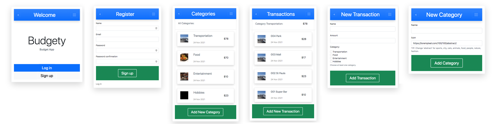

# Budget App

This a Ruby on Rails based budget app, an interactive project where you can add categories and transactions with user registration and login features.

## Screenshot



## Live Demo

https://floating-thicket-39409.herokuapp.com/

## Video Demo

https://www.loom.com/share/a42a3acee19842c197a1e85ec4fe745f

## Built With

- 
- 

## Getting Started

### Installation

1. Clone the repo

   git clone https://github.com/smunozmo/budget-app.git
  

### Usage

1. Install ruby gems dependencies

   ```sh
   bundle install
   ```

2. Install node dependencies

   ```sh
   npm install
   ```

3. Set up database

   ```sh
   rails db:create db:migrate db:seed
   ```

4. Run the web server

   ```sh
   rails server
   ```

5. Access to the website in a browser with the following link

   ```sh
   localhost:3000
   ``
### Test

For testing the classes run:

   ```sh
   bundle exec rspec spec
   ```

## Author

👤 **Sebastián Muñoz**

- GitHub: [@smunozmo](https://github.com/smunozmo)
- Twitter: [@smunozmo](https://twitter.com/smunozmo)
- Linkedin: [Sebastián Muñoz](https://www.linkedin.com/in/smunozmo/)
 
## 🤝 Contributing

Contributions, issues, and feature requests are welcome!

Feel free to check the [issues page](https://github.com/smunozmo/budget-app/issues).

## Show your support

Give a ⭐️ if you like this project!

## 📝 License

This project is [MIT](https://github.com/smunozmo/budget-app/blob/development/LICENSE) licensed.
